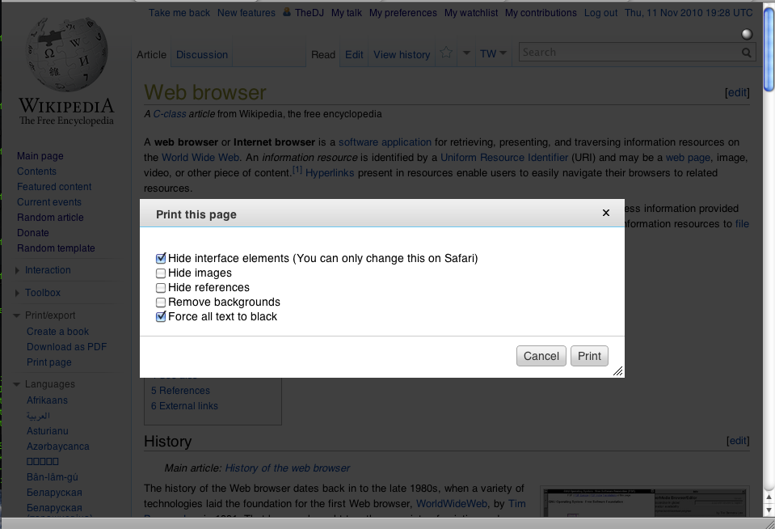

## ¿Qué es un Scroll Infinito?

Scroll infinito es una ténica en la que cargamos contenido según hacemos scroll hacia abajo en la página. En una página clásica digamos que hay un inicio y un fin en ese desplazamiento, pero con la carga de contenido automática al llegar al final, crea una simulación de que realmente no hay fin en esa página.

### Beneficios, cuando utilizarlo y por qué.

El principal beneficio para el usuario es que no tiene que pensar en cargar más contenido. O sea, es más fluido, si instintivamente baja la pantalla, el contenido se carga sin que el interactúe con un enlace. 

A esto se le une el del rendimiento, no necesitamos cargar la página otra vez y por otro lado podemos acceder a todo el contenido que queramos, porque empieza con un tramo y según lo acabes, se añade otro tramo de carga. Supone una mejora en rápidez de acceso y de ancho de banda a su vez. Aunque sí tendremos que estar pendendientes de los fallos de Memory Leak, y tenerlo bien encapsulado con los compponentes que tengan que hacer uso de él y que no itneractúe con otros.

Está claro que este tipo de tácticas vienen bien cuando queremos ofrecer al usuario gran cantidad de datos de manera directa y fácil, sin que él tenga que interactuar. Los grandes ejemplos serían redes sociales, blogs, páginas de comercio. En esos casos interesa mostar lo máximo disponible en menos tiempo de búsqueda. 

Con todo esto, está claro que si optimizamos recursos, mejoramos el rendimiento y mejorasmos la experiencia de usuario por ofrecerle más sin que le cueste esfuerzo, hay muchas razones para un tilizar un scroll infinito.

Por otro lado, daré también una razón para no usarlo. Cada vez hay más psicólogos que se pronuncian en contra de su uso. Esta facilidad de interacción y acceso a datos infinitos, genera una dependencia que puede desenvocar en problemas patológicos serios. Por lo que no me muestro tan partidario de su uso.

### Implementación

Para su uso, no hemos utilizado ninguna librería externa. Sólo hemos "jugado" con una escucha que espera eventos de scroll, comparamos si la altura de nuestro window, más el desplazamiento superior de nuestro documento es igual a la altura total del documento, carga más datos:

```
  window.onscroll = () => {
    if (
      window.innerHeight + document.documentElement.scrollTop ===
      document.documentElement.offsetHeight
    ) {
      cargarMasContenido();
    }
  };
```

## ¿Qué es un Modal?

Es una ventana emergente sobre nuestra aplicación o página que intenta llamar la atención del usuario, y que realmente lo consigue, porque si no interactuas con ella o intentas hacer click en la parte visible de la ventana principal, mantendrá el foco y no nos permitará continuar con nuestra operación.  




### Beneficios, cuando utilizarlo y por qué.
